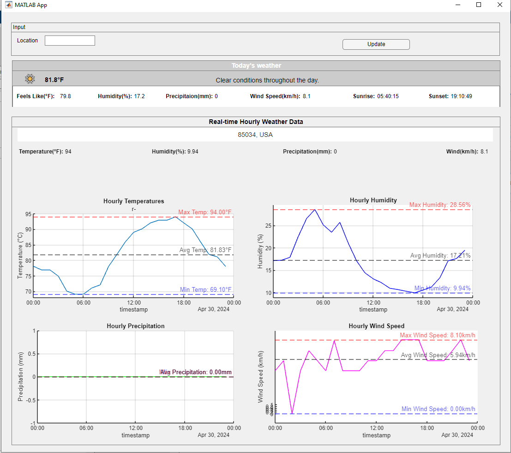
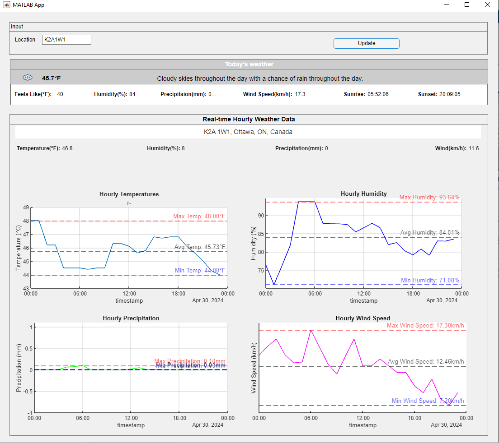

# Weather Real-time App with Matlab: An application for Real-time Weather Visulization made by Matlab

## Table of Contents
* [Introduction](#introduction)
* [Running App](#running-app)
* [Documentation](#documentation)
* [Contact](#contact)
* [License](#license)

## Introduction
The app visualize the real-time weather data fetched from [Weather Data API](https://www.visualcrossing.com/weather-api). The data is updated every 6 minutes. You can change the interval if you want.

## Running App
You can run the app by runnning appdesigner code in the [weather_app_matlab] folder.

## Documentation
* After running the app, you can see the hourly real-time weather data in your location without inputting any paramters.

* If you click [Update] after inputting [City], you can get the real-time weather data in that location.

## Contact
I hope to work with you. If you have any projects, you can contact me via Skype ID [live:.cid.b8144cf89d38b550]. I can help you in many areas including software development, web development and simulation. Thanks for your attention.

## License
[GNU GPL](LICENSE.txt)
